# Language Grammar 添加流程详解 - 第六部分：完整流程图

## 1. 整体流程图

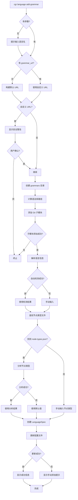

## 2. Git 子模块添加详细流程

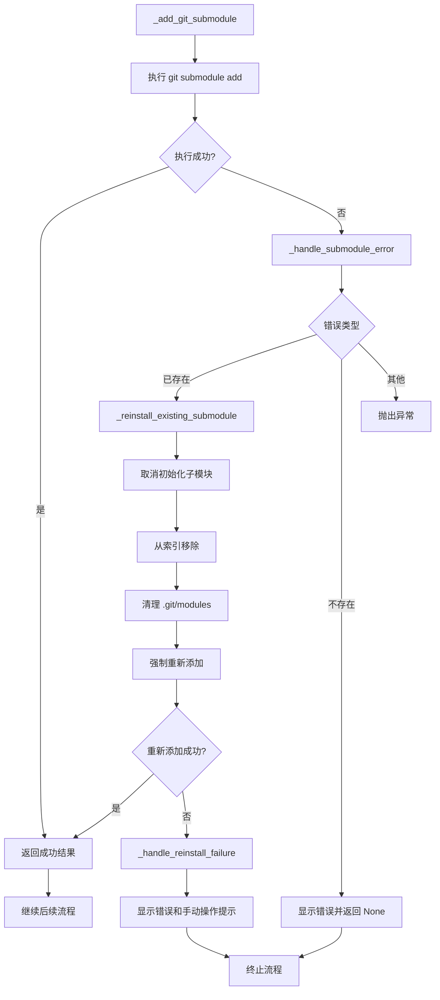

## 3. 语言信息检测流程

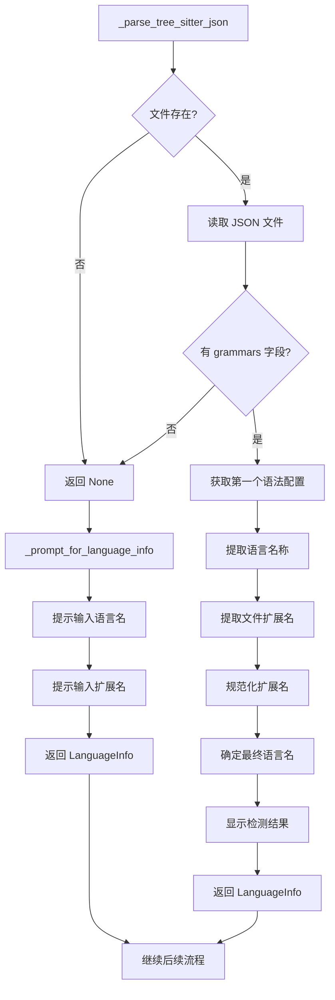

## 4. 节点类型分析流程

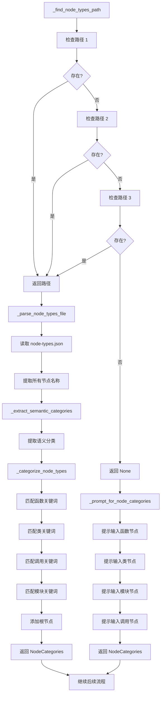

## 5. 配置文件更新流程

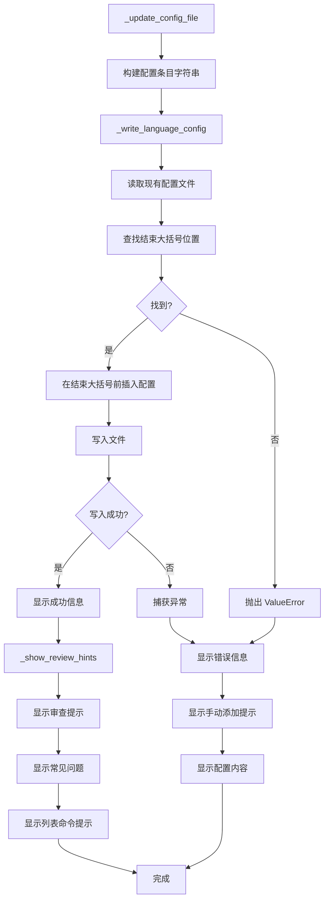

## 6. 标准方式完整流程

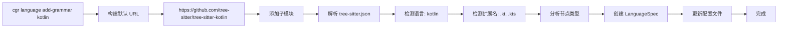

## 7. 自定义方式完整流程

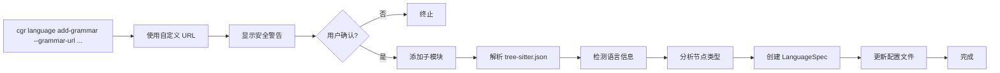

## 8. 错误处理流程

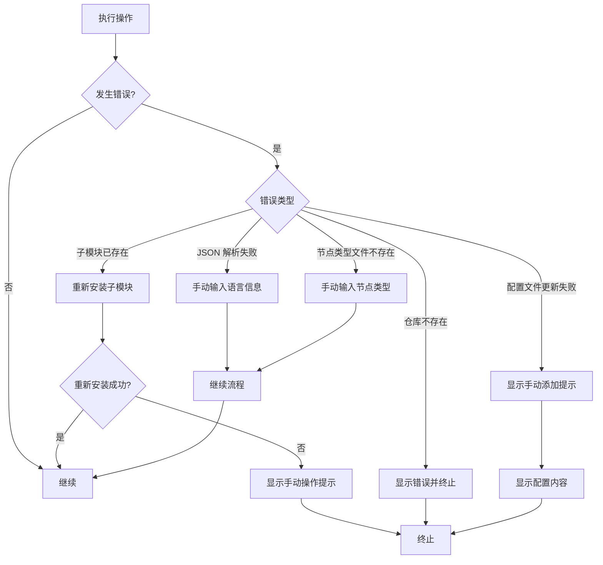

## 9. 数据流图

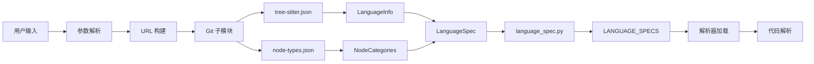

## 10. 关键函数调用链

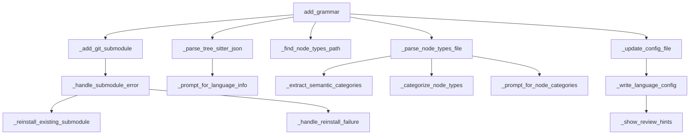

## 11. 两种方式的对比流程

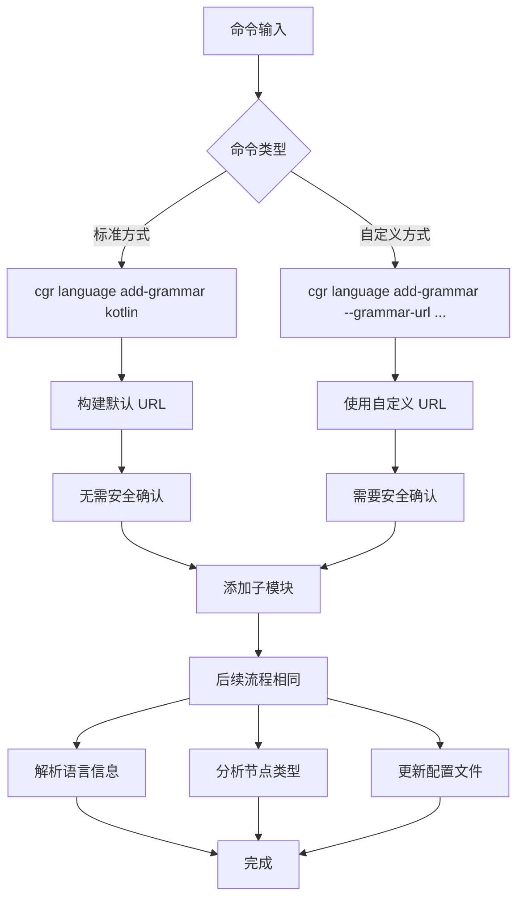

## 12. 相关文档

- [第一部分：总览和入口流程](./01-overview-and-entry.md)
- [第二部分：Git 子模块添加流程](./02-git-submodule.md)
- [第三部分：语言信息检测流程](./03-language-detection.md)
- [第四部分：节点类型分析流程](./04-node-types-analysis.md)
- [第五部分：配置文件更新流程](./05-config-update.md)
