# Code-Graph-RAG MCP 协议详解 - 第六部分：完整流程图

## 1. MCP 服务器启动流程

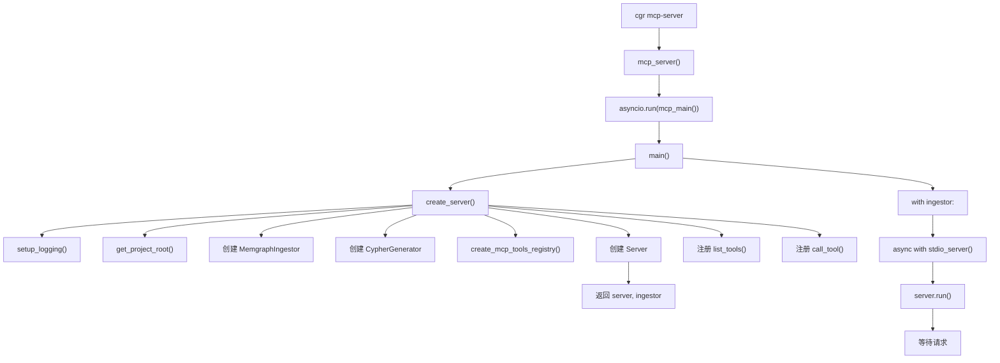

## 2. 工具列表请求流程

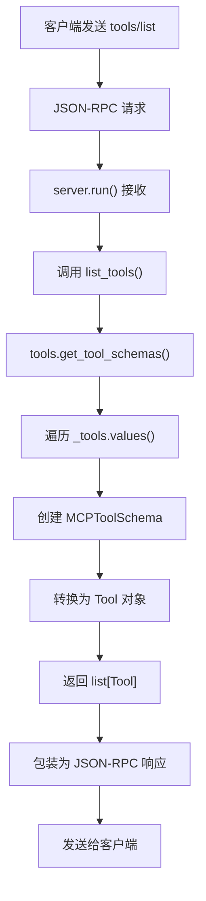

## 3. 工具调用请求流程

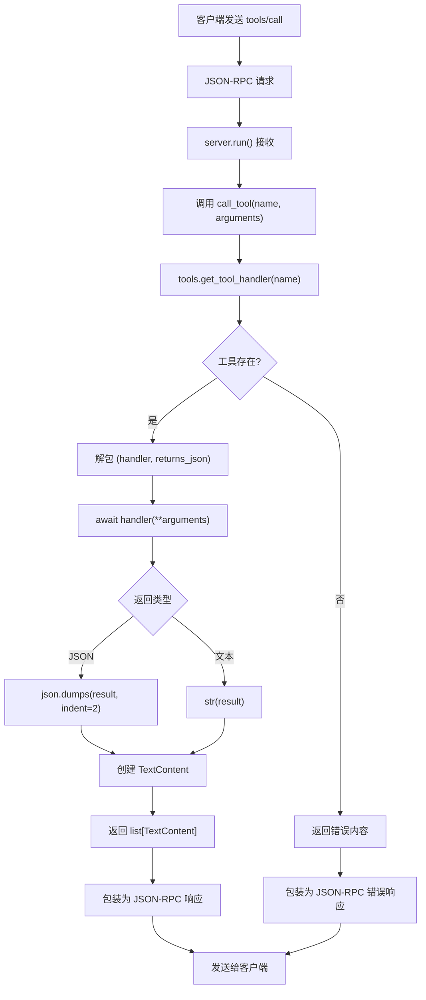

## 4. 工具处理器查找流程

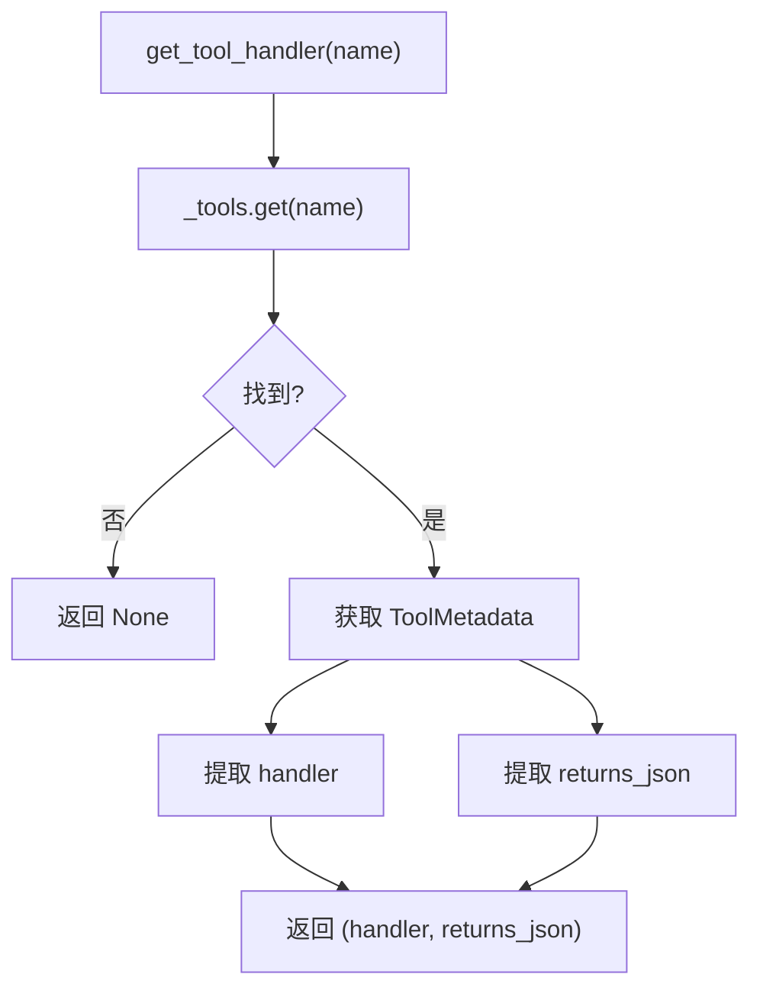

## 5. query_code_graph 工具执行流程

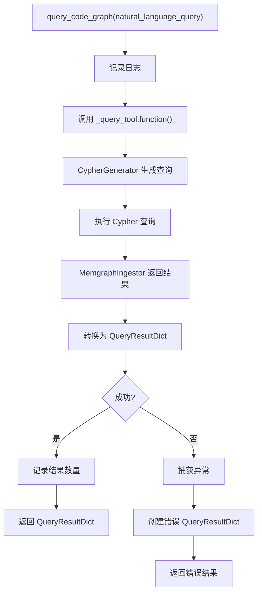

## 6. get_code_snippet 工具执行流程

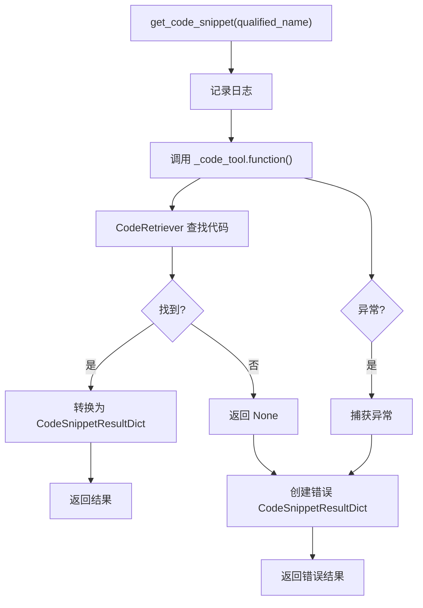

## 7. index_repository 工具执行流程

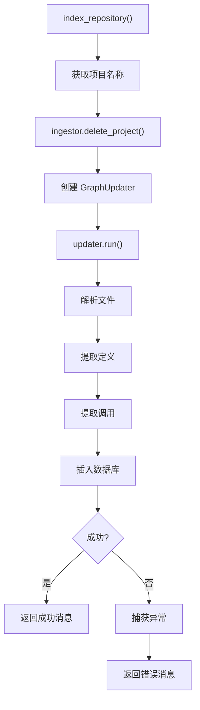

## 8. read_file 工具执行流程

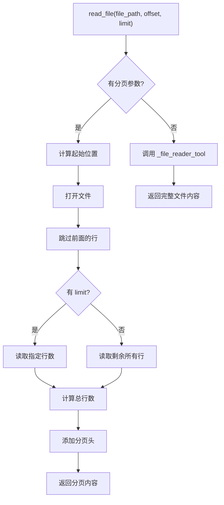

## 9. 错误处理流程

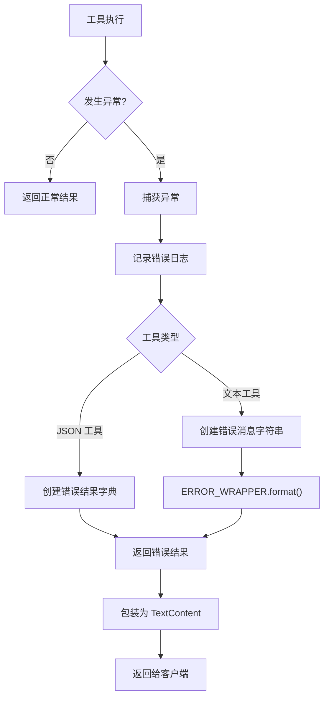

## 10. 数据流图

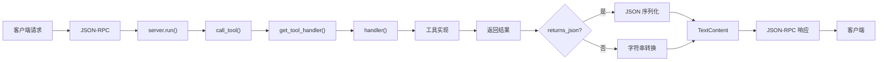

## 11. 工具注册表初始化流程

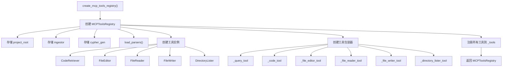

## 12. 完整请求-响应循环

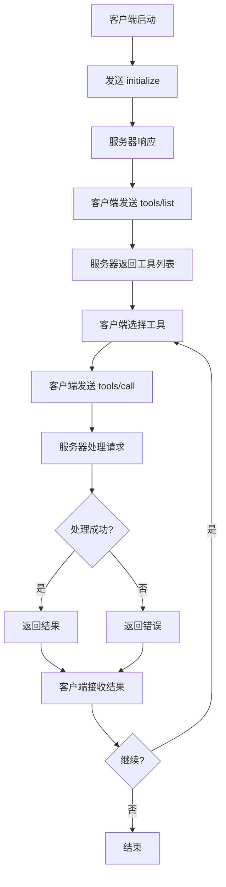

## 13. 项目根目录解析流程

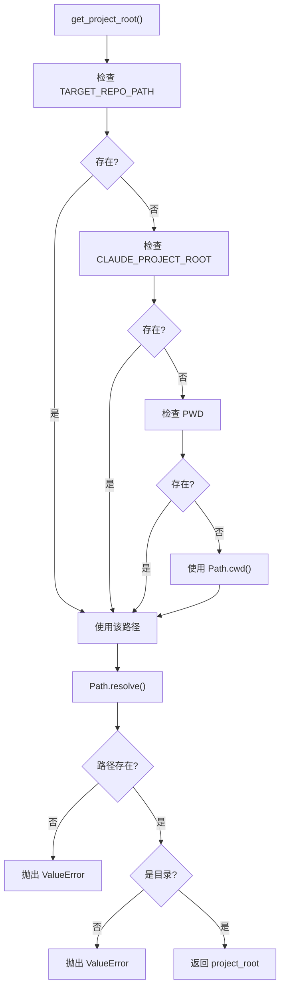

## 14. 相关文档

- [第一部分：MCP 协议概述和服务器初始化](./01-overview-and-initialization.md)
- [第二部分：MCP 协议消息格式](./02-message-format.md)
- [第三部分：工具注册和调度](./03-tool-registry.md)
- [第四部分：工具实现详解](./04-tool-implementations.md)
- [第五部分：数据结构和类型定义](./05-data-structures.md)
