# Code-Graph-RAG 工作流程详解 - 第六部分：完整流程图

## 1. 整体流程图

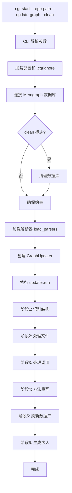

## 2. 文件处理详细流程

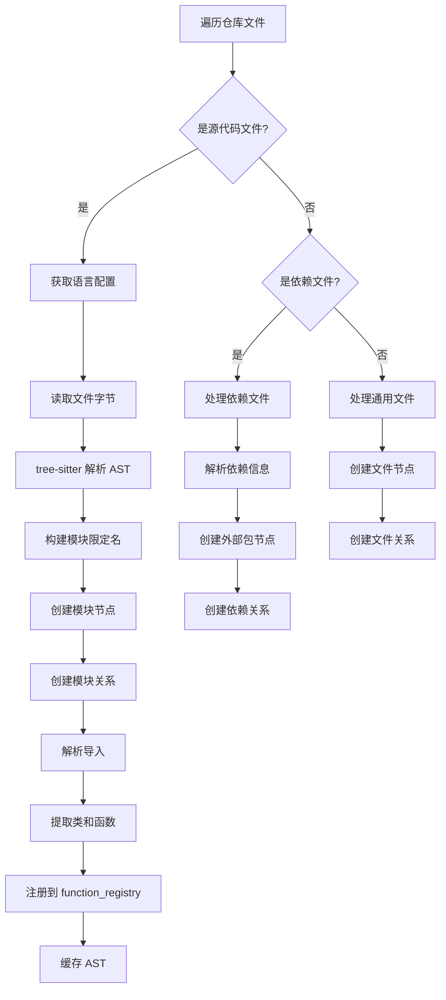

## 3. Java 类解析流程

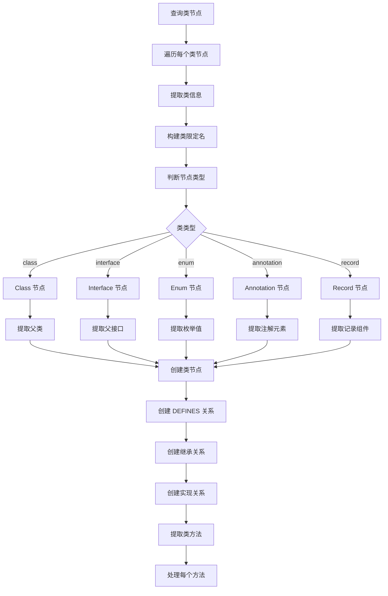

## 4. Java 方法解析流程

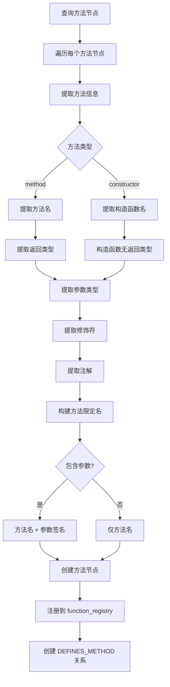

## 5. 方法调用解析流程

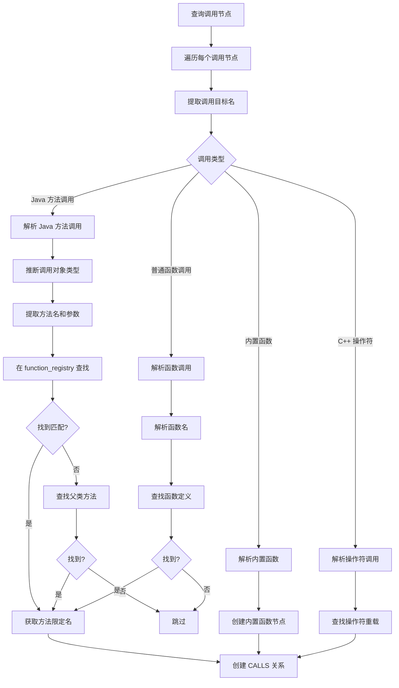

## 6. 数据库插入流程

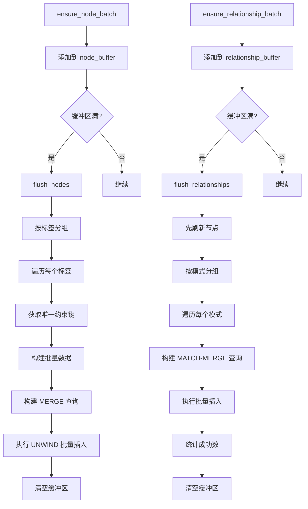

## 7. 类型推断流程

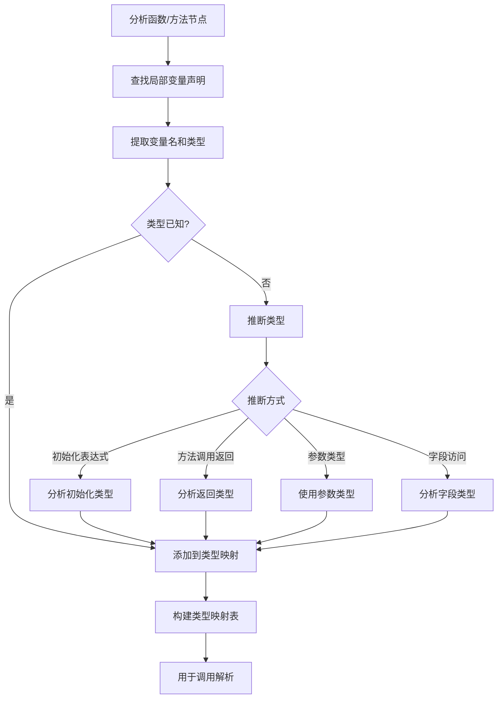

## 8. 查询流程

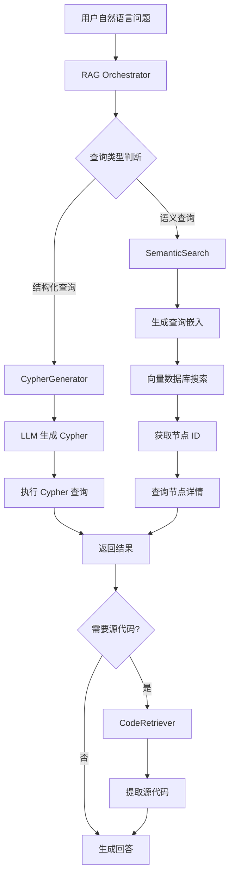

## 9. 导入解析流程

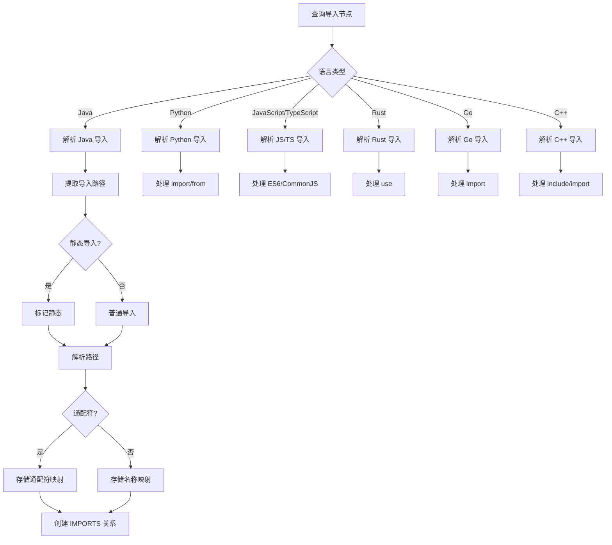

## 10. 方法重写检测流程

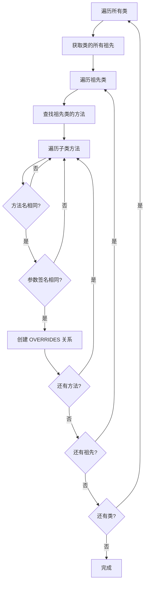

## 11. 嵌入生成流程

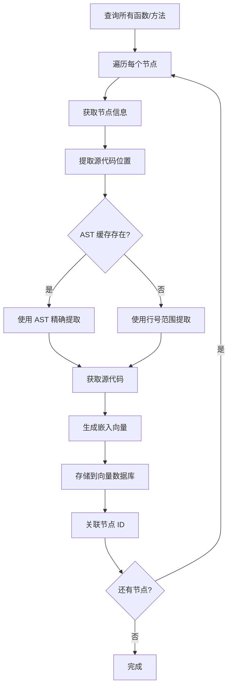

## 12. 完整数据流图

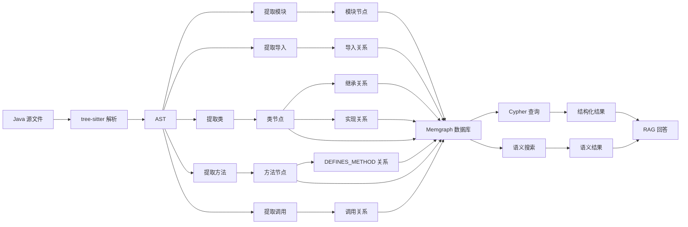

## 13. 相关文档

- [第一部分：总览和入口流程](./01-overview-and-entry.md)
- [第二部分：Java 语法解析详细流程](./02-java-parsing.md)
- [第三部分：数据库插入逻辑](./03-database-insertion.md)
- [第四部分：查询逻辑](./04-query-logic.md)
- [第五部分：关键数据结构](./05-data-structures.md)
